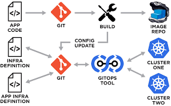
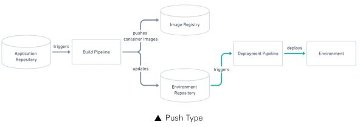
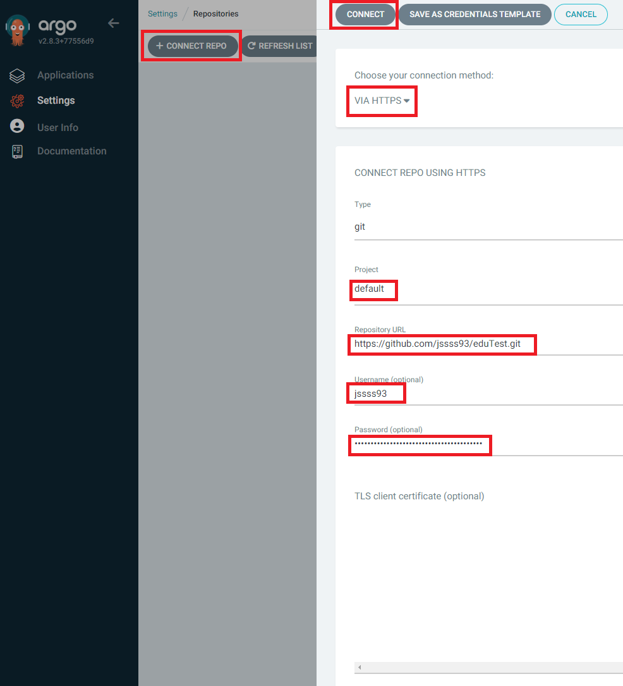
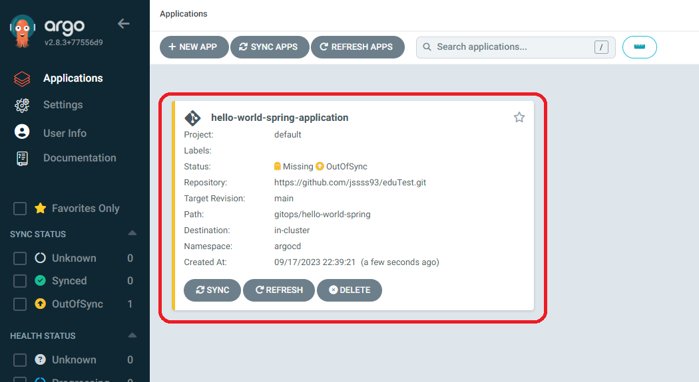
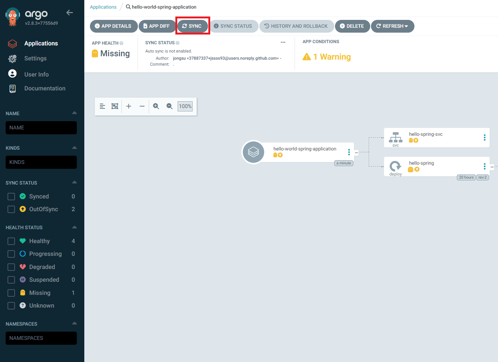
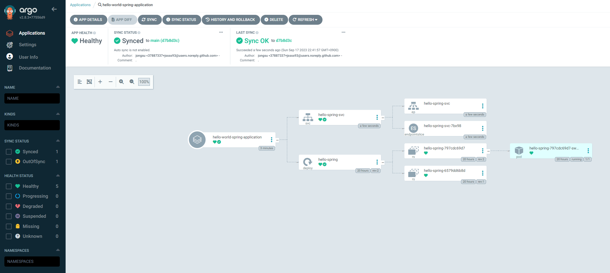
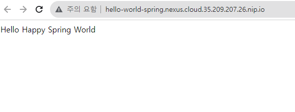
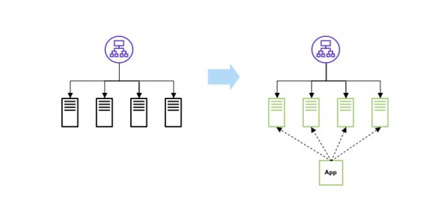
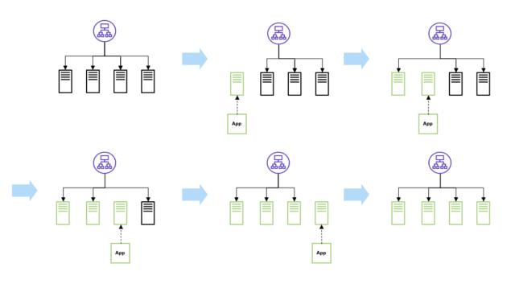

# ArgoCD

### 1.ArgoCD란?

### 

| 웹사이트        | https://github.com/argoproj/argo-cd |
| :-------------- | :---------------------------------: |
| 발표일          |           2018년 4월 4일            |
| 프로그래밍 언어 |                 Go                  |
| 최근 버전       |       2.8.3 (2023.09.01 기준)       |
| 종류            |             지속적 통합             |
| 라이선스        |                 MIT                 |

ArgoCD는 Kubernetes 환경에 Gitops 스타일의 배포를 지원하는 CD 도구이며 Gitops 환경에 Git repository를 통하여 application을 등록 할 수 있습니다.

Git 소스가 변경 된 것을 감지하면 Sync를 맞춰줌으로서 변경된 소스를 Kubernetes에 배포하게 되는 방식으로 운영 됩니다.

즉, 쿠버네티스의 구성 요소를 배포하기 위해서는 Manifest (ex).yaml 파일을 구성해 실행해야 하는데 이러한 파일들은 계속해서 변경되기 때문에 지속적인 관리가 필요합니다. 이를 간편하게 `Git`으로 관리하는 방식이 `GitOps`이고 간편하게 `GitOps`를 실현시키며 `Kubernetes`에 배포하는 툴이 `ArgoCD`입니다.

`ArgoCD`는 `GitOps` 방식으로 관리되는 `Manifest(yaml)` 파일의 변경사항을 감시하며, `현재 배포된 환경의 상태`와 `Github/Gitlab Repository Manifest 파일`에 정의된 상태를 동일하게 유지하는 역할을 수행합니다.


#### 1.1 ArgoCD 구성

**API 서버**

API 서버는 ArgoCD의 웹 대시보드, ArgoCD CLI를 통해 요청을 처리하기 위한 API를 노출하는 gRPC/REST 서버이다. ArgoCD API 서버는 아래와 같은 역할을 한다.

- ArgoCD 애플리케이션 관리 및 상태 보고
- ArgoCD 애플리케이션에서 수행할 수 있는 작업 호출(예: Sync, Rollback, Refresh 등)
- Git Repository와 및 k8s 클러스터에 연결하기 위한 자격 증명 관리(k8s secrets로 저장됨)
- 인증, RBAC
- Git webhook 이벤트 리스너

**리포지토리 서버**

리포지토리 서버는 애플리케이션의 매니페스트를 보관하는 Git Repository의 캐시를 관리하는 서비스이다. 아래의 Input을 필요로 한다.

- 저장소 URL
- Revisions(commit, tag, branch)
- 애플리케이션 Path
- 기타 템플릿별 설정(helm values.yaml)

**애플리케이션 컨트롤러**

애플리케이션 컨트롤러는 실행 중인 애플리케이션을 지속적으로 모니터링하고 현재의 Live state를 Target State와 비교하는 Kubernetes 컨트롤러이다. ArgoCD 애플리케이션이 `OutOfSync` 상태에 빠지면 이를 감지 하고, Auto Sync 옵션이 Enable 상태라면 자동으로 되돌리는 동작도 이 애플리케이션 컨트롤러에 의해 이루어지게 된다.


---


#### 1.2 ArgoCD 프로세스


a. 특정 마이크로서비스의 변경사항이 Source repo에 commit 된다.

b. Jenkins의 Build Job이 해당 변경사항을 감지하거나 수동으로 Job을 실행하여 Docker Image 빌드를 수행한다.

c. 빌드의 결과물은 Nexus Image Repository에 Push된다. (With Unique Tag Number)

d. 해당 Tag를 kustomize 명령어로 GitOps repo의 deployement manifest에 업데이트한다.

e. d단계에서 업데이트한 deployment의 변경사항이 GitOps repo에 commit 된다.

f. GitOps를 향해 polling을 수행하고 있던 ArgoCD가 변경사항을 감지하고 Synchronize(배포)를 수행한다.


---


#### 1.3 GitOps란?

'GitOps' 라는 개념은 ['](https://www.weave.works/)[Weaveworks'](https://www.weave.works/) 사(社)가 처음 만든 용어로 알려져 있다. 이것은 말 그대로 형상 관리 도구인 'Git' 을 통해 개발자에게 익숙한 방식으로 **인프라 또는 어플리케이션의 선언적인 설정파일을 관리하고 배포**하는 일련의 프로세스를 말한다.

`GitOps`는 `DevOps`의 실천 방법 중 하나로, 애플리케이션의 배포와 운영에 관련된 모든 요소들을 `Git`에서 `관리(Operation)` 한다는 뜻이다.
`GitOps`는 `Git Pull` 요청을 사용하여 `인프라 프로비저닝` 및 `배포`를 `자동`으로 관리한다.
`Git` 레포지토리에는 전체 시스템 상태가 포함되어 있어 시스템 상태의 변화 추이를 `확인`, `감사`할 수 있다.



#### **GitOps 전략**

깃옵스는 푸시 타입(Push Type)과 풀 타입(Pull Type), 두 가지의 배포 전략을 가이드 하고 있다. 
어느 이벤트를 트리거로 하여 CD 파이프라인이 동작하는가의 차이이다. 깃옵스를 구현할 때는 보안상의 이유로 풀 타입 배포 전략을 권장하고 있다.


**Push Type**



Push Type의 깃옵스를 구현한다면 배포 환경과 형상이 달라지는 경우 이에 대한 Notification을 받을 수 있어야 한다. 후술할 Pull Type과 달리 Push Type은 구조적으로 원천에 대한 지속적인 체크가 이루어지지 않기 때문이다. 변경사항이 발생한 것을 확인하였다면 형상을 다시 일치시키는 동작까지도 자동화가 필요하다. 또한 Push 이벤트 한 번이면 배포 환경까지 변경 사항이 발생하기 때문에 중간에 인가 절차도 추가되는 편이 좋다. 한 마디로 손이 많이 간다.

그럼에도 Push Type이 사용되는 이유로는 단순한 아키텍처를 꼽을 수 있다. 지속적으로 레포지토리를 체크할 필요가 없고 Push 이벤트만 옵저빙 하면 되기 때문이다.


**Pull Type**


ArgoCD가 Pull Type에 해당한다. ArgoCD는 연결된 Git Repository를 지속적으로 비교하고 있다가 차이가 감지되면 저장소의 상태를 기준으로 매니페스트를 Pulling하여 배포된 애플리케이션의 상태를 갱신한다. 이러한 컨셉 때문에 ArgoCD의 AutoSync옵션을 Enable해두면 k8s 클러스터에서 수동으로 변동사항이 발생하더라도 ArgoCD에서 관리되고 있는 매니페스트라면 다시 원상태로 자동 복원시킨다. 이는 배포된 환경의 상태는 반드시 단일 원천인 Git Repository만을 기반으로 한다는 점을 명확히 하는 동작이다.

**왜 Pull Type을 권장하는가?**

깃옵스를 구현할 때는 Pull Type 배포 전략을 권장하는데, 그 이유는 자격정보의 관리 때문이다. Push를 하기 위해서는 Push를 수행하는 지점에서(비록 외부 환경이라 할 지라도)관리 정보를 가지고 있어야 하며, 어떤 방식으로든 비인가자에 의하여 해당 Git Repository로 Push 이벤트가 발생한다면 배포 환경에 변경이 발생하여 피해를 입을 수 있기 때문이다.

이와 반면에 Pull 이벤트를 기반으로 동작한다면 CD를 수행하는 ArgoCD에서만 해당 레포지토리에 대한 인증 정보를 가지고 있으면 되고, Pull 권한만을 필요로 하기 때문에 SSOT에 의도치 않은 변경이 발생할 위험으로부터 비교적 자유로워진다.


---


### 2.사전준비

#### 2.1 Gitops

##### 2.1.1 hello-world-spring

**gitops/hello-world-spring/deployment.yaml**

```yaml
apiVersion: apps/v1
kind: Deployment
metadata:
  name: hello-spring
  namespace: nexus
spec:
  replicas: 1
  revisionHistoryLimit: 3
  selector:
    matchLabels:
      app: hello-spring
  template:
    metadata:
      labels:
        app: hello-spring
    spec:
      containers:
      - image: nexus-repo.nexus.cloud.35.209.207.26.nip.io/test/spring-test:1.0.0
        name: hello-spring
        ports:
        - containerPort: 8080

```

**gitops/hello-world-spring/service.yaml**

```yaml
apiVersion: v1
kind: Service
metadata:
  name: hello-spring-svc
spec:
  ports:
  - port: 8080
    targetPort: 8080
  selector:
    app: hello-spring
```

**gitops/hello-world-spring/ingress.yaml**

```yaml
apiVersion: networking.k8s.io/v1
kind: Ingress
metadata:
  name: hello-world-spring-nexus
  namespace: nexus
spec:
  ingressClassName: traefik
  rules:
  - host: hello-world-spring.nexus.cloud.35.209.207.26.nip.io
    http:
      paths:
      - backend:
          service:
            name: hello-spring-svc
            port:
              number: 80
        path: /
        pathType: Prefix

```

**gitops/hello-world-spring/kustomize**

```yaml
apiVersion: kustomize.config.k8s.io/v1beta1
kind: Kustomization
resources:
- service.yaml
- deployment.yaml
- ingress.yaml
images:
- name: nexus-repo.nexus.cloud.35.209.207.26.nip.io/test/spring-test
  newTag: 1.0.0
```


---


##### 2.1.2 hello-world-express

**gitops/hello-world-express/deployment.yaml**

```yaml
apiVersion: apps/v1
kind: Deployment
metadata:
  name: hello-express
  namespace: nexus
spec:
  replicas: 1
  revisionHistoryLimit: 3
  selector:
    matchLabels:
      app: hello-express
  template:
    metadata:
      labels:
        app: hello-express
    spec:
      containers:
      - image: nexus-repo.nexus.cloud.35.209.207.26.nip.io/test/express-test:1.0.0
        name: hello-express
        ports:
        - containerPort: 3000

```

**gitops/hello-world-express/service.yaml**

```yaml
apiVersion: v1
kind: Service
metadata:
  name: hello-express-svc
spec:
  ports:
  - port: 8080
    targetPort: 3000
  selector:
    app: hello-express
```

**gitops/hello-world-express/ingress.yaml**

```yaml
apiVersion: networking.k8s.io/v1
kind: Ingress
metadata:
  name: hello-world-express-nexus
  namespace: nexus
spec:
  ingressClassName: traefik
  rules:
  - host: hello-world-express.nexus.cloud.35.209.207.26.nip.io
    http:
      paths:
      - backend:
          service:
            name: hello-express-svc
            port:
              number: 80
        path: /
        pathType: Prefix
```

**gitops/hello-world-express/kustomize**

```yaml
apiVersion: kustomize.config.k8s.io/v1beta1
kind: Kustomization
resources:
- service.yaml
- deployment.yaml
- ingress.yaml
images:
- name: nexus-repo.nexus.cloud.35.209.207.26.nip.io/test/express-test
  newTag: 1.0.0
```


---


##### 2.1.3 hello-world-flask

**gitops/hello-world-flask/deployment.yaml**

```yaml
apiVersion: apps/v1
kind: Deployment
metadata:
  name: hello-flask
  namespace: nexus
spec:
  replicas: 1
  revisionHistoryLimit: 3
  selector:
    matchLabels:
      app: hello-flask
  template:
    metadata:
      labels:
        app: hello-flask
    spec:
      containers:
      - image: nexus-repo.nexus.cloud.35.209.207.26.nip.io/test/flask-test:1.0.0
        name: hello-flask
        ports:
        - containerPort: 8082

```

**gitops/hello-world-flask/service.yaml**

```yaml
apiVersion: v1
kind: Service
metadata:
  name: hello-flask-svc
spec:
  ports:
  - port: 8080
    targetPort: 8082
  selector:
    app: hello-flask
```

**gitops/hello-world-flask/ingress.yaml**

```yaml
apiVersion: networking.k8s.io/v1
kind: Ingress
metadata:
  name: hello-world-flask-nexus
  namespace: nexus
spec:
  ingressClassName: traefik
  rules:
  - host: hello-world-flask.nexus.cloud.35.209.207.26.nip.io
    http:
      paths:
      - backend:
          service:
            name: hello-flask-svc
            port:
              number: 80
        path: /
        pathType: Prefix

```

**gitops/hello-world-flask/kustomize**

```yaml
apiVersion: kustomize.config.k8s.io/v1beta1
kind: Kustomization
resources:
- service.yaml
- deployment.yaml
- ingress.yaml
images:
- name: nexus-repo.nexus.cloud.35.209.207.26.nip.io/test/flask-test
  newTag: 1.0.0
```


---


### 3.ArgoCD 설치

#### 3.1 helm Chart 준비

```bash
$ helm search repo argo (23.09.01 기준)
NAME            CHART VERSION   APP VERSION     DESCRIPTION
bitnami/argo-cd 5.1.2           2.8.3           Argo CD is a continuous delivery tool for Kuber...

$ helm pull bitnami/argo-cd --version 5.1.2 
$ tar -zxvf argo-cd-5.1.2.tgz
argo-cd/Chart.yaml
argo-cd/Chart.lock
argo-cd/values.yaml
argo-cd/templates/NOTES.txt
argo-cd/templates/_helpers.tpl
argo-cd/templates/application-controller/clusterrole.yaml
argo-cd/templates/application-controller/clusterrolebinding.yaml
argo-cd/templates/application-controller/deployment.yaml
...

$ cd argo-cd

```


#### 3.2 helm install&delete

```bash
$ helm install argocd bitnami/argo-cd --version 5.1.2 -f values.yaml -n nexus \
--set server.ingress.enabled=true \
--set server.ingress.hostname=argocd.nexus.cloud.35.209.207.26.nip.io \
--set server.insecure=true \
--set config.secret.argocdServerAdminPassword=new1234! 

$ helm delete argocd -n nexus
```


---


### 4.ArgoCD 설정 

#### 4.1 초기설정

**ArgoCD 접속**


**Settings->Repositories 이동**


**CONNECT REPO -> VIA HTTPS이동 **




**Repositry 생성 확인 & Create Application**


---


### 5.ArgoCD 배포하기

#### **5.1Spring Application**

**Application 설정값 입력 및 Application Create**


**Application 생성확인 및 상세 이동**



Sync 수행




**배포 완료 및 확인**



```bash
$ kubectl get all -n nexus
```


---


### 6. 형상 변경 테스트

#### 6.1 Source 변경 

eduTest\hello-world-spring\demo\src\main\java\com\example\demo\HelloController.java 변경

```java
package com.example.demo;

import org.springframework.web.bind.annotation.GetMapping;
import org.springframework.web.bind.annotation.RestController;

@RestController
public class HelloController {

	@GetMapping("/")
	public String index() {
		return "Hello Happy Spring World";
	}

}
```

#### 6.2 동적 이미지 태그 적용

Jenkinsfile 변경

```groovy
def TAG = new Date().format('yyyyMMddHHmmss')

...

		stage('Build & push') {
            container('podman') {
                sh """
                
                ...
                
                podman build -t ${NEXUS_HOST}/test/spring-test:${TAG} --tls-verify=false . 
                podman push ${NEXUS_HOST}/test/spring-test:${TAG}  --tls-verify=false
                """
            }
        }        
...
    	stage('gitOps Update') {
            container('podman') {
            sh"""
            
            ...
            
            kustomize edit set image ${NEXUS_HOST}/test/flask-test:${TAG}
            
            ...
            
            """
            }
        }
```


#### 6.3 ArgoCD Sync 

REFRESH -> SYNC -> SYNCHRONIZE


배포 확인




---


### 7. 다양한 배포전략

예전에는 수 개월 혹은 수 년에 한 번씩 서비스를 릴리스 했었지만, 최근에는 서비스를 더 작게 만들고(마이크로 서비스) 더 자주 배포(Deployment) 하는 방식으로 변화하고 있습니다. 그만큼 변경 사항이 생겼을 때 더 빠르게 반영할 수 있지만 코드에 손을 대는 것이란 항상 위험이 따르죠. 그렇기 때문에 이에 대응하여 배포 전략을 구성해야합니다.

가장 대표적인 배포 전략은 아래 네 가지가 되는데요. 아마 실제로 검색해보시면 AWS의 서비스들 중 배포 기능을 가진 것들에서 이들 중 하나는 꼭 들어가 있는 것을 볼 수 있을거에요.

- 인플레이스 배포 (In-place Deployment)
- 롤링 배포 (Rolling Update Deployment)
- 블루/그린 배포 (Blue/Green Deployment)
- 카나리 배포 (Canary Deployment)

각 배포 전략마다 장점과 단점이 모두 존재하기 때문에 상황에 따라 전략을 선택해야하는데요. 그럼 바로 각 배포 전략에 대해 알아보도록 하겠습니다.

#### 7.1 인플레이스 배포 (In-place Deployment)

인플레이스 배포는 사용중인 환경에 새로운 변경사항이 포함된 어플리케이션만 반영하는 방법입니다.



이 방식을 사용하는 대표적인 서비스가 CodeDeploy 인데요. 배포 그룹의 각 환경 (인스턴스) 에 있는 어플리케이션을 일시정지한 후, 최신 상태의 어플리케이션의 변경 사항이 설치되면 새 버전의 앱을 실행하는 형식으로 이루어집니다. 로드 밸런서를 사용하면 각 인스턴스가 배포중이더라도 등록을 해제할 수 있으며, 배포 완료 후에 이전 버전으로 복원도 가능합니다.

이것은 배포 방식 상 EC2, 온프레미스 환경에만 사용 가능한 배포 전략이 됩니다.

#### 7.2 롤링 배포 (Rolling Update Deployment)

여러 개의 가동중인 서버 (인스턴스)를 갖춘 환경에서 한 번에 정해진 수만큼의 서버에 새로운 변경 사항이 포함된 어플리케이션을 배포하는 방법입니다.



구 버전에서 새 버전으로 트래픽을 점진적으로 전환하며, 구 버전의 인스턴스도 점차 삭제됩니다. 그렇기 때문에 **서버 수의 제약이 있을 경우에는 유용한 방법**이 될 수 있지만 배포 중 인스턴스의 수가 감소 되기 때문에 서버 처리 용량을 미리 고려해야 합니다. 이 방식을 사용하고 있는 서비스는 Elastic Beanstalk와 CodeDeploy인데요. CodeDeploy는 공식문서에서 직접적으로 서술된 부분이 없기 때문에 알기 어렵지만 기본적으로 롤링 배포를 하도록 설정되어있습니다. 그래서 EC2, 온프레미스의 경우, 인플레이스 배포가 롤링 배포와 혼합된 방식을 따르고 있고, Lambda나 ECS의 경우는 롤링 배포가 기본적인 배포 방식이 된다고 이해하면 될 것 같네요.

덤으로 Elastic Beanstalk의 배포 방법을 보면, 롤링이 그냥 롤링과 추가 배치를 사용한 롤링으로 나뉘는데요. 둘 다 구 버전에서 새 버전으로 점진적으로 전환되는 것은 동일하지만, 추가 배치를 사용한 롤링의 경우는 새 버전의 인스턴스를 배포한 후 바로 시작하여 배포 프로세스 중에도 모든 용량이 유지되도록 합니다.

#### 7.3 블루/그린 배포 (Blue/Green Deployment)

새로운 변경사항이 포함된 어플리케이션을 위한 새로운 환경을 구축하고 교체하는 방법입니다.


흔히 블루/그린 배포를 "구 버전의 환경을 새 버전의 환경으로 똑같이 구축해서 한 번에 전환한다" 라고 생각하는데, 사실 이것은 Red/Black 배포의 정의입니다. 그래서 실제로는 "신 버전과 구 버전의 어플리케이션이 한 순간이라도 공존하였다" 라고 하는 것이 더 올바르다고 할 수 있습니다. (사실 Red/Black 배포에 대한 정의가 사람마다 다르다보니 모호한 개념이라는 건 안 비밀...) 이 이유에 대한 추가 설명은 아래 카나리 배포 부분 설명에 적어 놓을게요.

아무튼 블루/그린 배포는 하나의 버전만 프로덕션 되기 때문에 **버전 관리 문제를 방지**할 수 있고, **운영 환경에 영향을 주지 않고 실제 서비스 환경으로 새 버전 테스트가 가능**합니다.

또, 주로 인플레이스 배포와 비교될 때 언급되는 장점으로 새 버전으로 전환 후에 문제가 생겼을 시에 구 버전으로 되돌리기 위한 **롤백도 인플레이스 배포보다 더 빠르다**는 점이 있습니다.

단, 구 버전과 새 버전 두 환경 모두 갖출 필요가 있기 때문에 시스템 자원이 두 배로 필요해지며, 비용이 그만큼 비싸지기 때문에 비용을 고려한 구성을 필요로 한데요. 이런 단점은 AWS와 같은 클라우드 서비스에서는 종량 과금이라는 메리트가 있어 큰 부담 요소로 작용되지 않으니 그리 신경 쓸 부분은 아닙니다.

블루/그린 배포도 Elastic Beanstalk, CodeDeploy에서 이 방식을 사용할 수 있습니다.

#### 7.4 카나리 배포 (Canary Deployment)

가동 중인 서버들의 일부에만 새로운 앱을 배포하여, 일부 트래픽을 새 버전의 환경으로 분산하는 방법입니다.


**A/B 테스트가 가능**하고, **오류율 및 성능 모니터링**에 유용하게 사용할 수 있다는 장점이 있는데요. 트래픽을 분산시킬 라우팅은 임의적 또는 사용자 프로필 등을 기반으로 분류할 수 있습니다. 분산 후에 결과에 따라 새 버전이 운영 환경을 대체할 수도 있고, 다시 구 버전으로 되돌릴 수도 있어요.

이 방법을 사용하는 가장 대표적인 서비스는 API Gateway 인데, 사실 API Gateway 외에 카나리 방식이 언급된 서비스가 하나 있습니다. 바로 CodeDeploy 인데요. 블루/그린 배포의 배포 설정 타입의 종류 중 하나로 분류되어 있습니다.

위의 블루/그린 배포 설명에서 "구 버전의 환경을 새 버전의 환경으로 똑같이 구축해서 한 번에 전환한다" 라는 게 올바른 정의가 아니라고 했는데, 블루/그린 배포의 트래픽 전환 방식은 All-at-Once (한 번에) 만 있는게 아니기 때문입니다. 아래의 공식 문서를 보시면 카나리 외에도 리니어라는 방식도 있으며 블루/그린 배포 방식을 사용할 때도 트래픽을 몇 번에 나누어 전환이 가능한 것을 확인할 수 있습니다.


출처

```
https://velog.io/@ghkdtlwns987/GitOps-ArgoCD%EB%9E%80
https://isn-t.tistory.com/53
https://velog.io/@wlgns5376/GitOps-ArgoCD%EC%99%80-Kustomize%EB%A5%BC-%EC%9D%B4%EC%9A%A9%ED%95%B4-kubernetes%EC%97%90-%EB%B0%B0%ED%8F%AC%ED%95%98%EA%B8%B0
https://asuraiv.tistory.com/20
```


